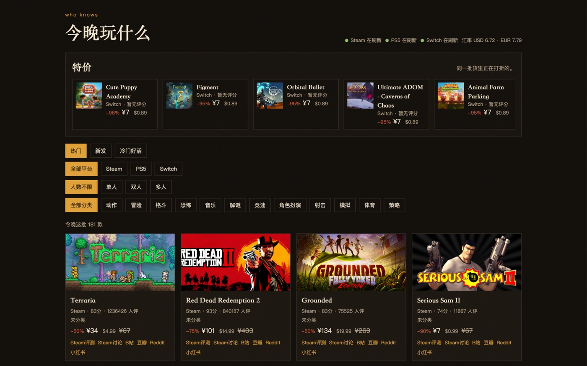

# Who Knows

今晚玩什么。一块会自己刷新的游戏推荐看板。

按口味、平台、人数和分类，从 Steam / PlayStation 5 / Nintendo Switch 的在售目录里挑今晚的游戏。特价不是另一套数据，只是同一批货里正在打折的。



## 功能

- **口味**：热门、新发、冷门好活
- **平台**：Steam、PS5、Switch
- **人数**：单人、双人、多人
- **分类**：动作、RPG、解谜等统一标签
- **价格**：原币与人民币并列，汇率随目录刷新
- **评分与讨论**：卡片上给出商店评分，并跳到 Steam 评测 / 讨论、B 站、豆瓣、Reddit、小红书
- **自动刷新**：服务端定时拉商店；页面定时读缓存。一家商店失败时保留上一份能用的数据

## 快速开始

需要 Python 3.12+ 与 [uv](https://docs.astral.sh/uv/)。

```bash
uv sync
uv run python serve.py
```

打开 [http://127.0.0.1:8765](http://127.0.0.1:8765)。

Docker：

```bash
docker compose up -d --build
```

默认端口同样是 `8765`。

```bash
uv run pytest
```

更完整的部署说明见 [自托管](docs/self-hosting.md)。数据流见 [架构](docs/architecture.md)。

## 配置

| 变量 | 默认 | 说明 |
| --- | --- | --- |
| `WHO_KNOWS_PORT` | `8765` | HTTP 端口 |
| `WHO_KNOWS_DATA` | `data/catalog.json` | 目录缓存路径 |
| `WHO_KNOWS_REFRESH` | `1800` | 后台刷新间隔（秒） |
| `HTTP_PROXY` / `HTTPS_PROXY` | 空 | 可选。访问 Steam 等商店需要代理时设置 |

本地覆盖写在仓库根目录的 `.env`（已加入 gitignore），不要把代理地址或密钥提交进仓库。

## 数据来源

Steam 使用官方 Storefront / appdetails。PlayStation 与 Nintendo 使用各自商店的公开目录接口。这些主机接口并非长期承诺的 API，某一家改版时只替换对应适配器。

本项目与 Valve、Sony、Nintendo 无关，也不提供游戏本体下载。

## 许可

[MIT](LICENSE)
